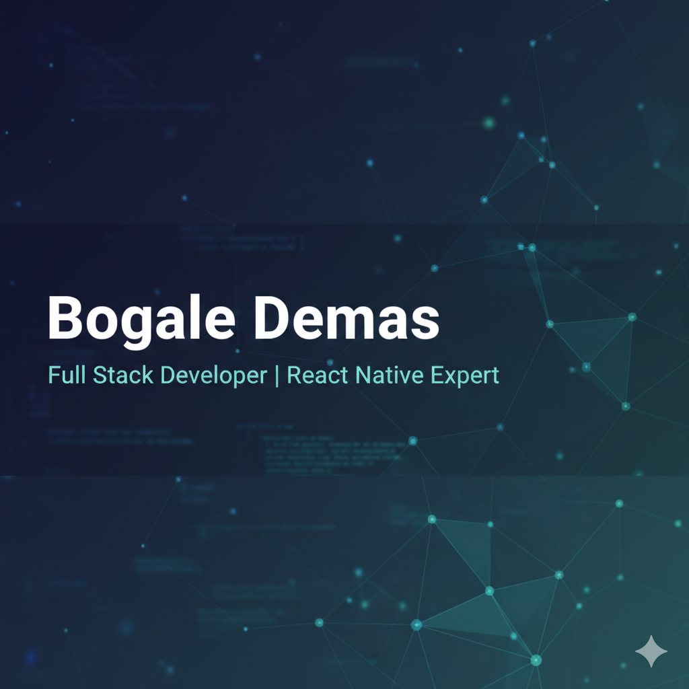

  

# Hi there! I'm Bogale Demas 👋 

### 🚀 Full-Stack Developer | React Native Expert

I am a passionate Full-Stack Developer dedicated to building fast, reliable, and user-centric applications. I specialize in the modern JavaScript ecosystem, bridging the gap between elegant mobile/web interfaces and robust backend architectures.

---

### 🛠️ Tech Stack

| Category | Technologies |
| :--- | :--- |
| **Frontend** |     |
| **Backend** |   |
| **Mobile** |   |
| **Database** |    |
| **DevOps & Tools**|    |

---

### 🔭 Current Focus & Goals

* 🔭 **Working on:** High-performance web and mobile applications.
* 🌱 **Learning:** Advanced System Design and Cloud Scalability.
* 💬 **Ask me about:** React Native performance, Next.js, or Database optimization.
* 😄 **Pronouns:** He/Him

---

### 📊 GitHub Stats

  
  

---

### 📫 Let's Connect!

---

> **Fun Fact:** I believe clean code is just as important as code that works!
